# AI Lesson Planner 🎓✨

  
  

An intelligent lesson planning application that leverages AI to help educators create comprehensive lesson plans quickly and efficiently.

<video width="600" controls>
  <source src="./assets/demo_video.mp4" type="video/mp4">
  Your browser does not support the video tag.
</video>

<!-- 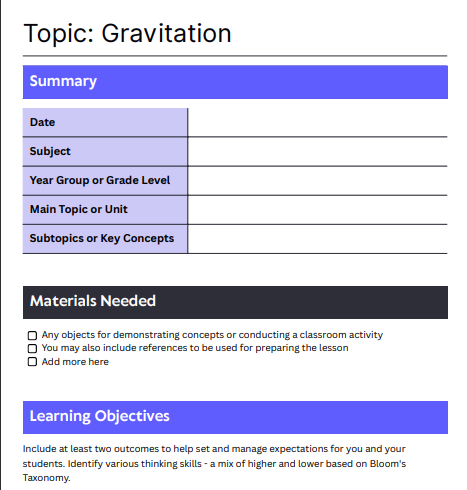 -->
<!-- 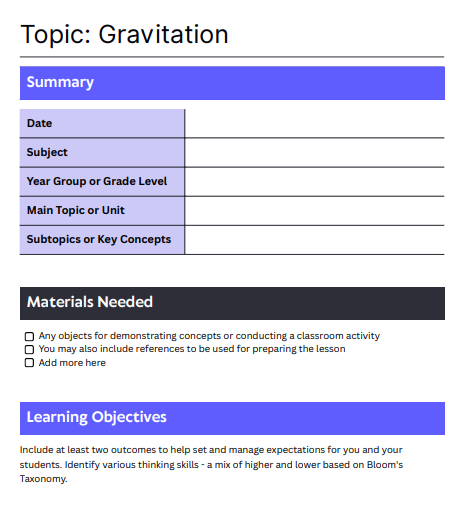  -->
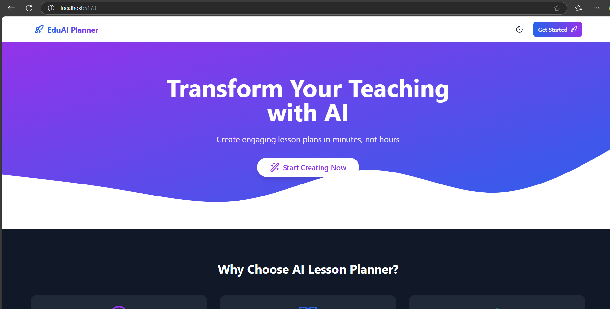 
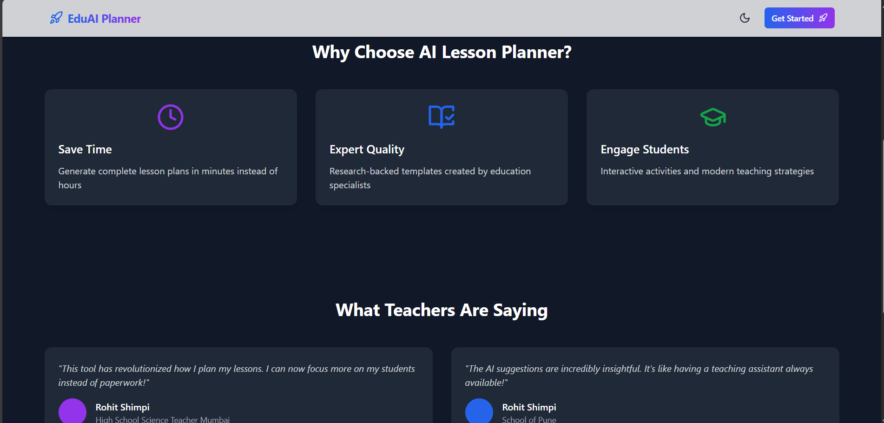 
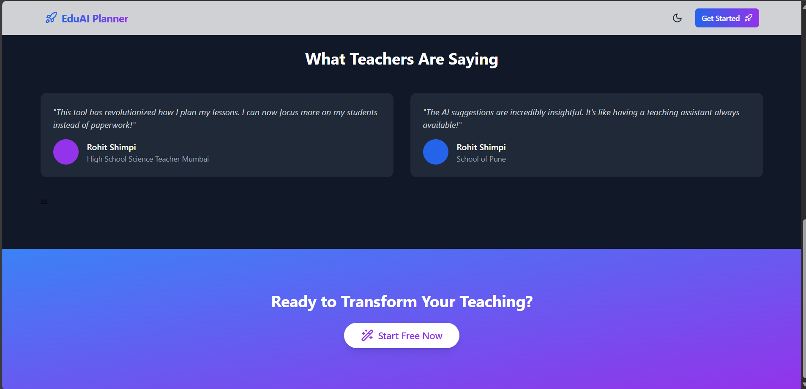 
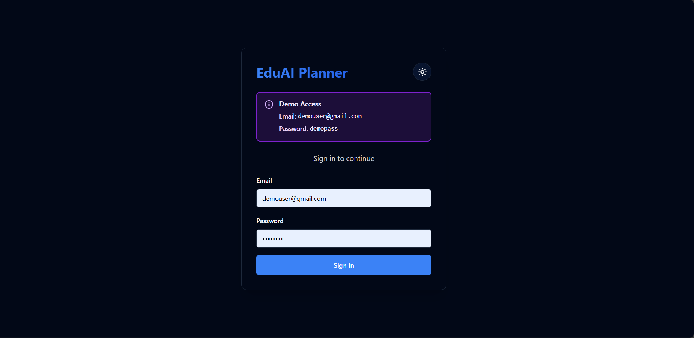 
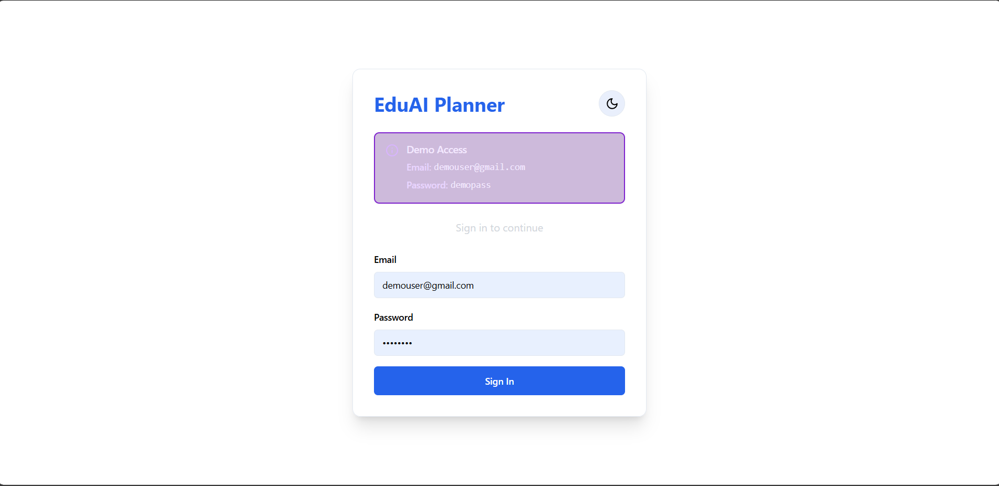 
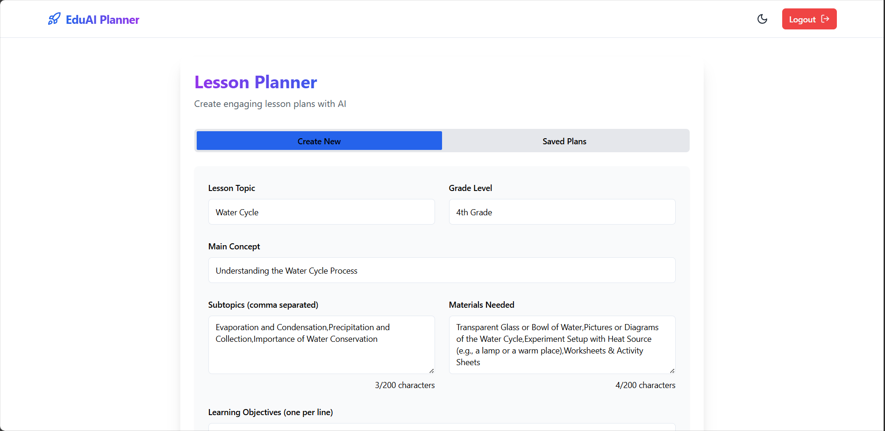 
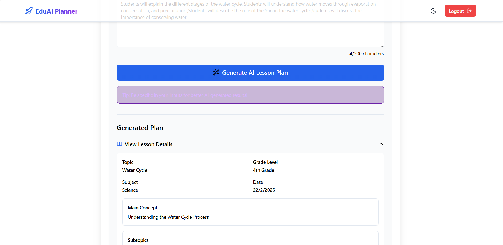 
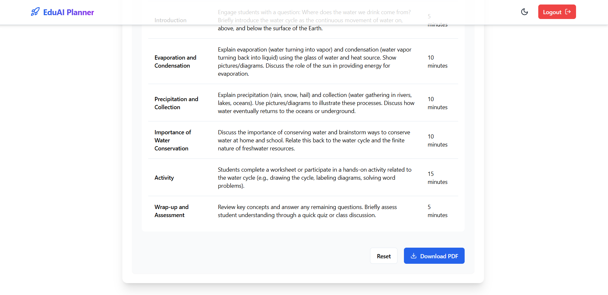 
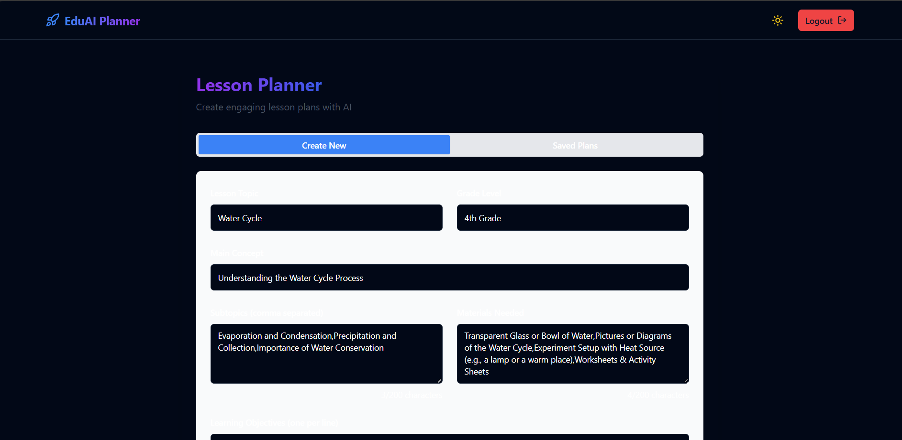 
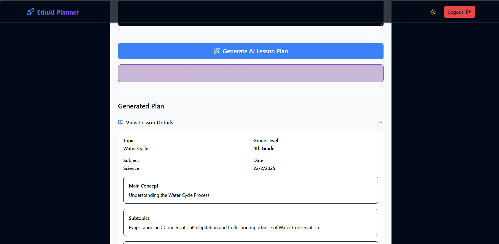 
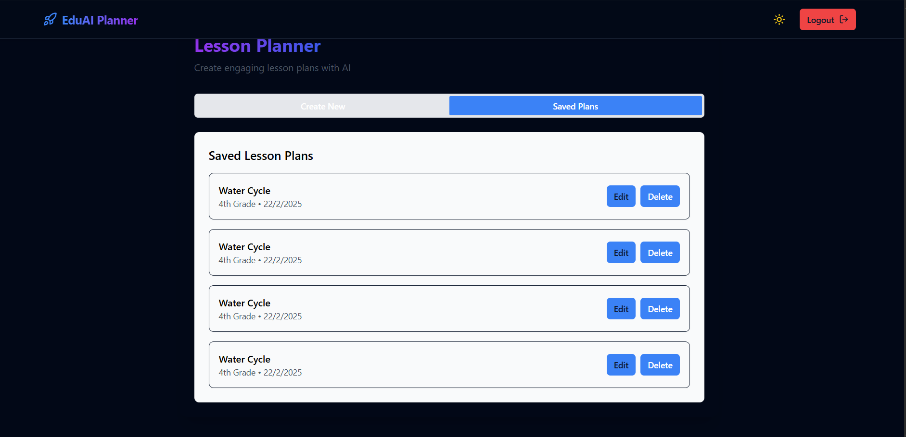 
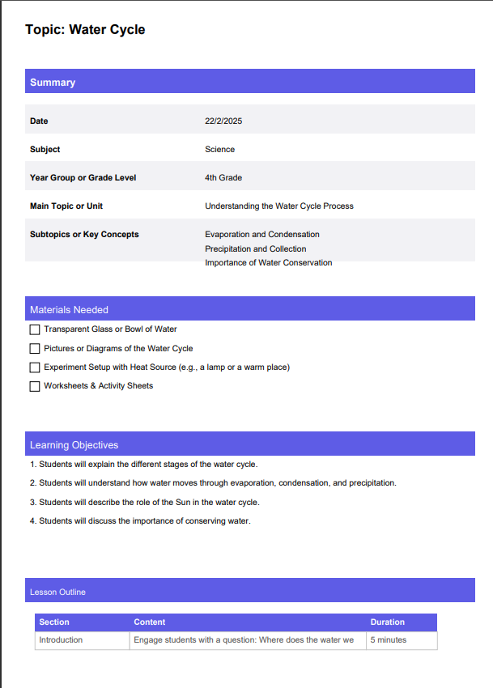 
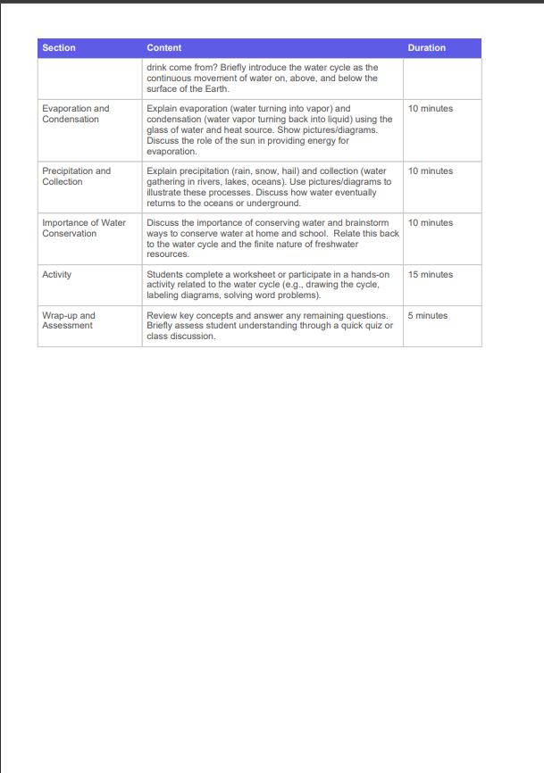 

---

## 🚀 Features

✅ **AI-Powered Lesson Generation** 🤖  
&nbsp;&nbsp;&nbsp;&nbsp;Automatically generate complete lesson plans using OpenAI's API

✅ **Dark/Light Mode** 🌓  
&nbsp;&nbsp;&nbsp;&nbsp;Built-in theme switching with persistent user preference

✅ **PDF Export** 📄  
&nbsp;&nbsp;&nbsp;&nbsp;Download generated lesson plans as printable PDF documents

✅ **Interactive Forms** 📝  
&nbsp;&nbsp;&nbsp;&nbsp;Intuitive form interface with real-time validation

✅ **Saved Lessons** 💾  
&nbsp;&nbsp;&nbsp;&nbsp;Local storage for saving and accessing previous lesson plans

✅ **Responsive Design** 📱  
&nbsp;&nbsp;&nbsp;&nbsp;Works seamlessly on desktop and mobile devices

✅ **Secure Authentication** 🔒  
&nbsp;&nbsp;&nbsp;&nbsp;Demo login system with protected routes

---

## 💻 Installation

### 1️⃣ Clone the repository
git clone https://github.com/rohitshimpi737/ai-lesson-planner.git
cd ai-lesson-planner
### 2️⃣ Install dependencies
npm install
 or
yarn install
### 3️⃣ Set up environment variables
Create a .env file in the root directory:
VITE_OPENAI_API_KEY=your_openai_api_key_here
### 4️⃣ Run the development server
npm run dev
 or
yarn dev

📘 Usage Guide
🔐 Authentication
Use demo credentials to log in:
📧 Email: demouser@gmail.com
🔑 Password: demopass

📝 Creating a Lesson Plan
Fill in lesson details (topic, grade level, subject)
Add learning objectives and materials
Click "Generate AI Lesson Plan"
Review and edit the generated plan
Save or export as PDF
🗂️ Managing Lessons
✅ Access saved lessons from the "Saved Plans" tab
✅ Edit or delete existing lesson plans
✅ Toggle between dark/light mode using the theme switch

🛠️ Technology Stack
Frontend
⚛ React + Vite
🎨 Tailwind CSS + ShadCN UI Components
🔗 React Router (v6)
🔥 Lucide Icons
AI Integration
🤖 OpenAI API (GPT-3.5/4)
📝 Custom prompt engineering for lesson planning
Utilities
📄 PDF generation using @react-pdf/renderer
💾 Local storage for persistent data
🔄 Form handling with React state management
🤝 Contributing
Contributions are welcome! Please follow these steps:
1️⃣ Fork the project
2️⃣ Create your feature branch
git checkout -b feature/AmazingFeature
3️⃣ Commit your changes
git commit -m 'Add some AmazingFeature'
4️⃣ Push to the branch
git push origin feature/AmazingFeature
5️⃣ Open a Pull Request

📄 License
This project is open-source and available under the MIT License.

👨‍💻 Developed with ❤️ by Your Name
